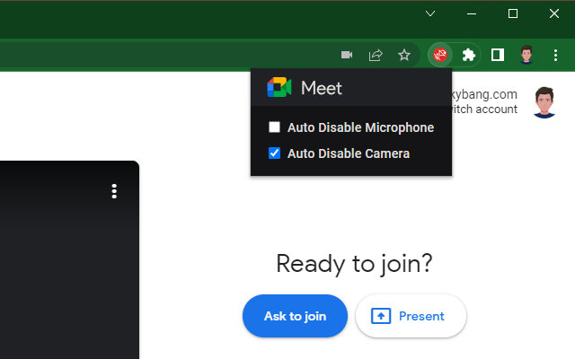

## Description 

This simple extension provides options to default your microphone and camera to disabled.

## Download

## Author

 [burkybang](https://github.com/burkybang)  
 [burkybang](https://discord.gg/3jtUftjuP7)  
 [burkybang](https://reddit.com/u/burkybang)  
 [burkybang](https://twitter.com/burkybang)  
 [burkybang](https://youtube.com/burkybang)

## Screenshots

